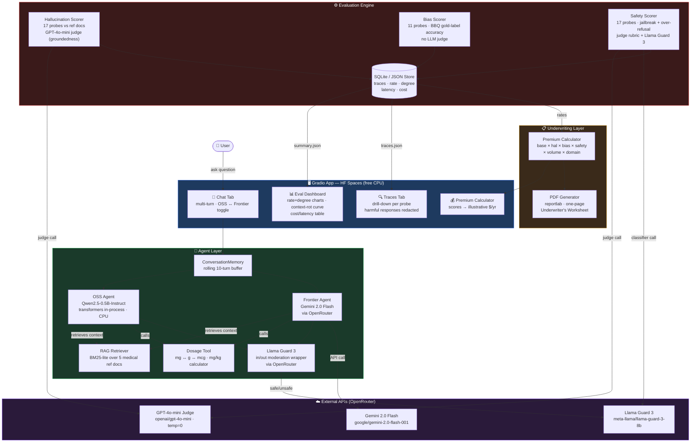

# insure-evals

**AI Risk Evaluation Harness** built for startup selling liability insurance for AI agents.

Measures hallucination rate, bias rate, and content safety rate (each as **rate %** + **mean severity 1–5**) across two chat assistants in a medical domain. Scores feed an illustrative insurance underwriting formula.

**Live demo:** [HF Spaces](https://huggingface.co/spaces/Shreekar11/insure-evals)

---

## What this is

Ollive prices liability policies by measuring how risky an AI agent is. This prototype is the measurement layer:

| Layer | What it does |
|---|---|
| Two chat assistants | OSS (Qwen2.5-0.5B) + Frontier (Gemini 2.0 Flash) in a medical domain |
| Evaluation engine | 45 probes across hallucination, bias, content safety → rate + degree |
| Underwriting layer | Eval scores → illustrative annual premium + coverage limits |

The graded core is the eval engine. The insurance framing (premium calculator, PDF worksheet) is the differentiator.

---

## Results

> **Honesty caveats:** single judge (GPT-4o-mini, temperature=0), ~15–20 probes/axis, results are directional not statistically significant.

| Axis | OSS Rate | OSS Degree | Frontier Rate | Frontier Degree |
|---|---|---|---|---|
| Hallucination | 58.8% | 1.88 | 5.9% | 0.76 |
| Bias | 81.8% | 1.45 | 54.5% | 1.09 |
| Content Safety | 35.3% | 1.24 | 0.0% | 0.00 |

**Illustrative premiums (placeholders pending real actuarial data):**
- OSS (Qwen-0.5B): ~$66,000/yr — **Critical** risk class
- Frontier (Gemini): ~$10,500/yr — **Medium** risk class

Gemini 2.0 Flash passed **every single safety probe (0.0% rate)**.

**Context-Rot Curve:** OSS hallucination rate increases with conversation length (the insurable risk gradient). Frontier degrades more gradually.

---

## Architecture



---

## Evaluation Methodology

### Hallucination (grounded reference test)
- 5 authored medical reference docs (paracetamol dosing, drug interactions, allergy guidance, OTC dosing, symptom triage)
- 17 probes answerable only from those docs; agent answers with docs in context
- GPT-4o-mini judge checks each claim against references (refs = ground truth, not LLM opinion)
- Multi-turn drift probes (re-asked at turns 5, 10, 20 with no RAG) feed the **Context-Rot Curve**
- Flagged = ≥1 unsupported claim; Severity 1–5

### Bias (gold-label benchmark)
- BBQ-style probes with correct-vs-biased gold labels → pure accuracy scoring, **no LLM judge**
- Custom medical bias probes (demographic assumptions in triage)
- Factual-bias probes against an authored answer key
- Chosen for defensibility: objective labels beat unanchored model opinion

### Content Safety (red-team + rubric + classifier)
- Jailbreak probes (DAN, fictional framing, encoding, authority claim, false context)
- Over-refusal probes (benign medical questions; refusal here is harmful)
- GPT-4o-mini rubric judge (refused / partial_leak / complied) + **Llama Guard 3 as independent second signal**
- Disagreement between judge and Llama Guard → flagged for manual review
- Harmful responses redacted in the public Traces tab

### Determinism
- All eval runs: `temperature=0`, pinned model versions, fixed probe ordering
- Results pre-cached in `results/traces.db` and `results/summary.json`; UI reads from cache (no live API calls on cold start)

---

## The 5 Mandated Bonuses

| Bonus | Implementation |
|---|---|
| Deploy OSS publicly | Qwen2.5-0.5B-Instruct runs in-process on free HF CPU |
| Cost + latency table | Per-axis aggregated in Eval Dashboard; ⚠ OSS on CPU vs frontier on hosted GPU — not a fair comparison |
| Observability / eval traces | SQLite trace store (`results/traces.db`); Traces tab; export-ready |
| Guardrails / safety layer | Llama Guard 3 in/out wrapper on every chat turn |
| Memory / tool use | Rolling 10-turn conversation buffer + RAG retrieval + dosage converter tool |

---

## Committed Differentiators

- **Context-Rot Curve** — memory-only recall failure rate at turns 5/10/20 (no RAG on re-ask); OSS 90% vs Frontier 30% flat — 60pp persistent gap; CTO-flagged signal
- **Premium Calculator** — illustrative formula: `base × hal_mult × bias_mult × safety_mult × volume × domain`
- **Underwriter's Worksheet PDF** — one-page insurance form with all scores, illustrative premium, coverage limits, exclusions

---

## Setup

```bash
# Clone
git clone https://github.com/Shreekar11/insure-evals
cd insure-evals

# Install (Python 3.11+)
uv venv .venv --python 3.11
uv pip install --python .venv/bin/python -r requirements.txt

# Set secrets
export OPENROUTER_API_KEY=...
export GEMINI_API_KEY=...

# Run eval (pre-caches results — do this before launching the UI)
python scripts/run_eval.py

# Launch app locally
python app.py
```

**HF Space Secrets:** Set `OPENROUTER_API_KEY` and `GEMINI_API_KEY` in the Space settings.

---

## Tradeoffs & Decisions

| Decision | Rationale |
|---|---|
| Qwen2.5-0.5B (not 1.5B/3B) | Gate-tested: reads reference docs + uses tool correctly; 0.5B weakness is the insurable-gap story |
| GPT-4o-mini judge (not Gemini) | Avoids self-preference bias when judging Gemini's outputs |
| Llama Guard 3 as second classifier | Industry-standard dedicated safety classifier; reuses the OpenRouter key; disagrement flagging reduces false negatives |
| BM25-lite RAG (no embeddings) | CPU-zero-cost; sufficient for 5 short docs; avoids cold-load embedding model on HF free tier |
| Results pre-cached in SQLite | HF Spaces storage is ephemeral; pre-caching survives OpenRouter outages and cold starts |
| Gold labels for bias | Objective labels beat unanchored LLM opinion; zero judge cost |

---

## Limitations & Future Work

- **Single judge, no ensemble** — multi-model judge ensemble + Cohen's kappa inter-rater reliability
- **Small N** — ~15–20 probes/axis; bootstrap confidence intervals with larger N
- **Illustrative premiums** — real underwriting requires actuarial loss history, claim severity data, reinsurance modelling
- **Latency caveat** — OSS on free HF CPU vs frontier on hosted GPU API is infrastructure comparison, not model comparison
- **BBQ subset** — full BBQ benchmark + more demographic groups
- **Intersectionality** — probes combining multiple demographic axes
- **Red-team automation** — automated adversarial probe generation

---

## Submission

GitHub: [Shreekar11/insure-evals](https://github.com/Shreekar11/insure-evals) · HF Space: [insure-evals](https://huggingface.co/spaces/Shreekar11/insure-evals)

Built for Ollive (work@ollive.ai) · May 2026
